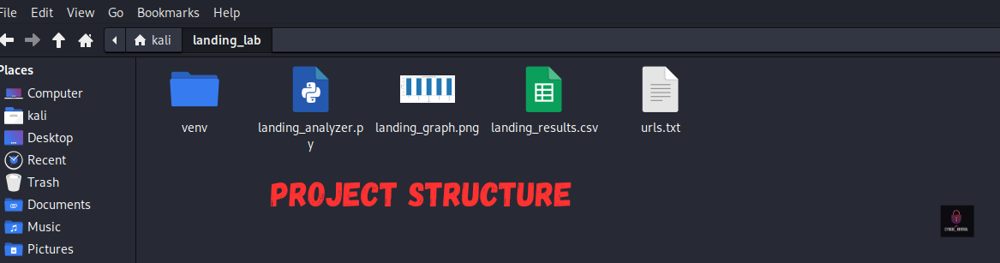
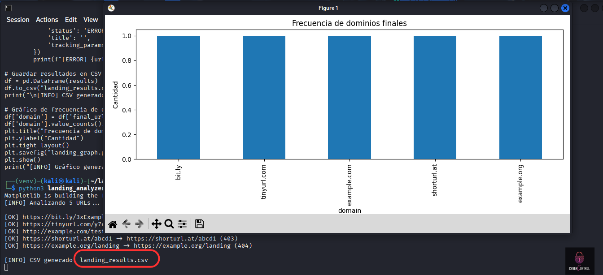
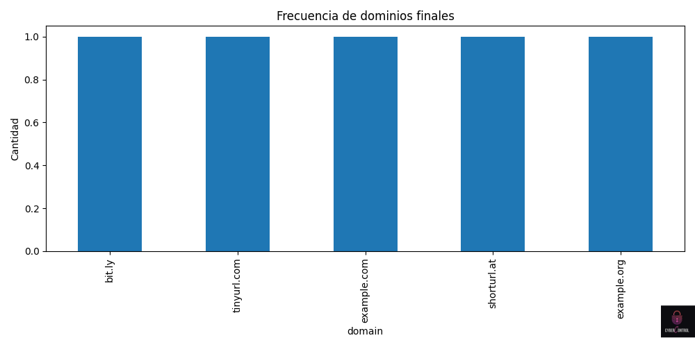
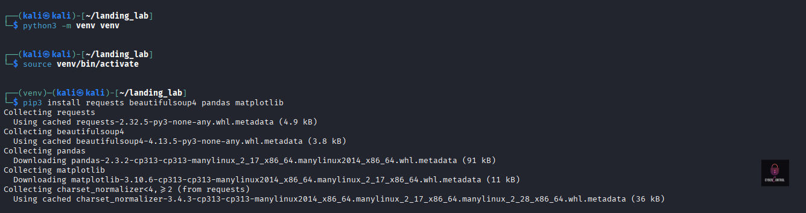
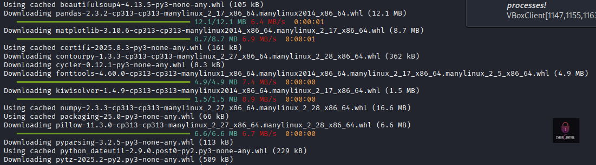
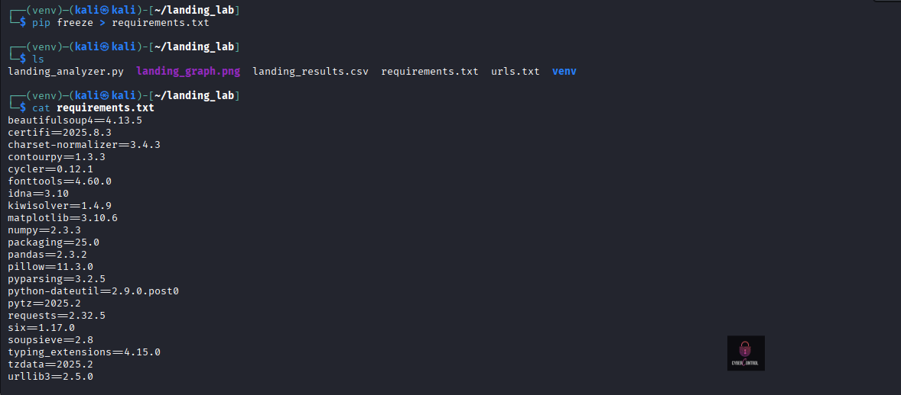
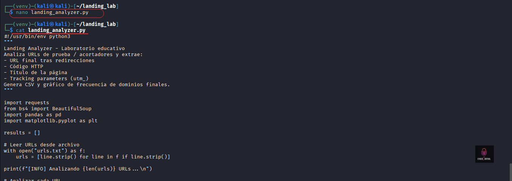
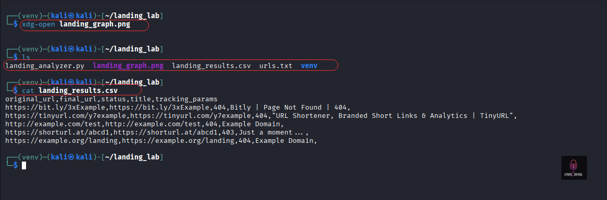
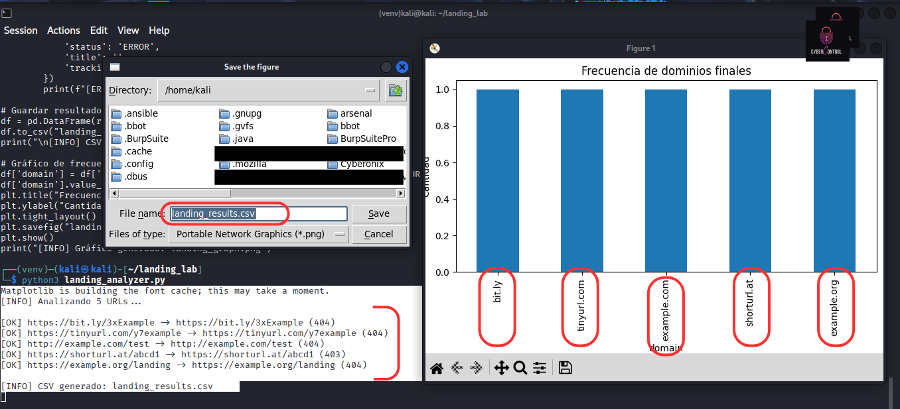

# Landing Analyzer 🕵️‍♂️

### Recomendación práctica:

Haz primero un entorno virtual (python -m venv venv o virtualenv venv).

Instala lo que uses realmente (pip install requests pandas matplotlib ...).

Luego ejecuta 

  ```
pip freeze > requirements.txt.
  ```
Herramienta educativa desarrollada en Python para analizar *landing pages* sospechosas (como links acortados o de phishing) y detectar:







- Redirecciones
- Estado HTTP (200, 403, 404…)
- Títulos de las páginas
- Parámetros de tracking


## 🚀 Uso
1. Clona este repositorio:
   ```
   git clone https://github.com/ImaneLamriui/Landing-Analyzer.git
   cd Landing-Analyzer
   ```
2. Crea un entorno virtual:
 ```
   python3 -m venv venv
   source venv/bin/activate
 ```


3. Instala dependencias:
   
 ```
  pip install -r requirements.txt
 ```





4. Añade tus URLs a urls.txt.

5. Ejecuta:
 ```
python landing_analyzer.py

```
  

6. Resultados:



landing_results.csv → reporte con análisis detallado

landing_graph.png → gráfico de estados HTTP



⚠️ Nota: Esta herramienta es únicamente para fines educativos y de investigación en ciberseguridad.
   
